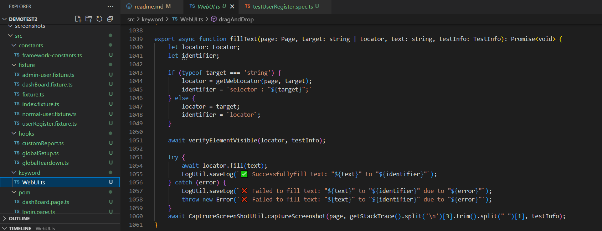

Author: Bui Thi Binh

# Playwright Automation Test Framework

This repository contains an automation testing framework built with [Playwright](https://playwright.dev/). It is designed to help you write, run, and maintain end-to-end tests for your web applications.

## Table of Contents

- [Features](#features)
- [Prerequisites](#prerequisites)
- [Installation](#installation)
- [Configuration](#configuration)
- [Writing Tests](#writing-tests)
- [Running Tests](#running-tests)
- [Reporting](#reporting)
- [Project Structure](#project-structure)

## Features

- **1.Cross-Browser Testing:** Supports Chromium, Firefox, and WebKit.

- **2.Parallel Execution:** Run tests in parallel to reduce execution time.

- **3.Built-in Reporting:** HTML, JSON, and custom reporters are supported.


- **4.Fixtures & Global Setup/Teardown:** Reusable test setup and cleanup logic.


- **5.Data-Driven Testing - Read data from file (json)** Easily run tests with multiple data sets.


- **6.Write log file:** Easily to trace log


- **7.Screenshoot all steps:** By set enviroment SCREENSHOT_ALL_STEPS = 'yes'. All screenshots were attached to report


- **8.Main keyword: WebUI** Call common funtions



## Prerequisites

- [Node.js](https://nodejs.org/) v12 or later.
- npm (comes with Node.js) or Yarn.
- Basic knowledge of TypeScript and Playwright.

## Installation

1. **Clone the repository:*

   ```bash
   git clone https://github.com/your-username/playwright-automation.git
   cd playwright-automation

- Basic knowledge of TypeScript and Playwright.

## Configuration

Playwright Configuration:
The configuration is in playwright.config.ts. Customize settings such as testDir, timeout, headless, and reporters:

```
import { defineConfig, devices } from '@playwright/test';
/**
 * Read environment variables from file.
 * https://github.com/motdotla/dotenv
 */
// import dotenv from 'dotenv';
// import path from 'path';
// dotenv.config({ path: path.resolve(__dirname, '.env') });

/**
 * See https://playwright.dev/docs/test-configuration.
 */
export default defineConfig({
  // Global setup: A file that runs once before all tests
  globalSetup: require.resolve('./src/hooks/globalSetup'),
  // Global teardown: A file that runs once after tests
  globalTeardown: require.resolve('./src/hooks/globalTeardown'),
  testDir: './',
  /* Run tests in files in parallel */
  fullyParallel: true,
  /* Fail the build on CI if you accidentally left test.only in the source code. */
  forbidOnly: !!process.env.CI,
  /* Retry on CI only */
  retries: process.env.CI ? 2 : 0,
  /* Opt out of parallel tests on CI. */
  workers: process.env.CI ? 1 : 2,
  /* 
   * Reporter configuration.
   * Here, we use multiple reporters:
   *  - 'list': Outputs test results to the terminal.
   *  - 'html': Generates an HTML report saved to the outputFolder; open: 'never' prevents auto-opening.
   *  - A custom reporter located at './src/hooks/customReport'.
   */
  reporter: [
    ['list'], 
    ['html', { outputFolder: 'playwright-report', open: 'never', logLevel: 'info' }],
    ['./src/hooks/customReport']
  ],
  /* Shared settings for all the projects below. See https://playwright.dev/docs/api/class-testoptions. */
  use: {
    /* Base URL to use in actions like `await page.goto('/')`. */
    // baseURL: 'http://127.0.0.1:3000',

    // Collect trace only when a test fails; helps with debugging.
    trace: 'off',
    // Capture screenshots for every test; you can change this to 'only-on-failure' if preferred.
    screenshot: 'on',
    headless: process.env.CI ? true : false  // Trong CI, chạy headless; trong local, có thể mở browser
  },

  /* Configure projects for major browsers */
  projects: [
    {
      name: 'chromium',
      use: { ...devices['Desktop Chrome'] },
    },

    {
      name: 'firefox',
      use: { ...devices['Desktop Firefox'] },
    },

    {
      name: 'webkit',
      use: { ...devices['Desktop Safari'] },
    },
  ],
});
```

## Environment Variables:

Create **_tests\resources\config.evn_** file for environment-specific data:

```
AUTHOR=Tester
DEFAULT_TIMEOUT=5000
BASE_URL=https://material.playwrightvn.com/
# Skipped Steps Screenshot
SCREENSHOT_SKIPPED_STEPS = yes
# All Steps Screenshot
SCREENSHOT_ALL_STEPS = yes

```
## Running Tests

To run your tests, use the Playwright CLI:
Run all: 
```
npx playwright test
```
Run only 1 browser: 
```
npx playwright test --project=chromium
```
Run and show head: 
```
npx playwright test --project=chromium --head
```
Run 1 file: 
```
npx playwright test example.spec.js 
```
Run 1 test: Mark the test case as: test.only and run file
```
npx playwright test testFile.spec.ts --workers=3 --project=chromium
```
## Running Tests in Parallel

Playwright runs test files in parallel by default. To control the number of workers:
```
npx playwright test testFile.spec.ts --workers=3
```

## Reporting
### HTML Report:
Generate an interactive HTML report:
```
npx playwright show-report
```
### Custom Reporter:
A custom reporter is implemented in ./src/hooks/customReport.ts for detailed logging and screenshot attachments.

## Project Structure

```
│   .gitignore
│   package-lock.json
│   package.json
│   playwright.config.ts
│   readme.md
│
├───logs
├───screenshots
├───src
│   ├───constants
│   │       framework-constants.ts
│   │
│   ├───fixture
│   │       admin-user.fixture.ts
│   │       dashBoard.fixture.ts
│   │       fixture.ts
│   │       index.fixture.ts
│   │       normal-user.fixture.ts
│   │       userRegister.fixture.ts
│   │
│   ├───hooks
│   │       customReport.ts
│   │       globalSetup.ts
│   │       globalTeardown.ts
│   │
│   ├───keyword
│   │       WebUI.ts
│   │
│   ├───pom
│   │       dashBoard.page.ts
│   │       login.page.ts
│   │       userRegister.page.ts
│   │
│   └───utils
│           captureScreenShotUtil.ts
│           logUtil.ts
│
├───test-results
│
└───tests
    │   test3.spec.ts
    │   test4.spec.ts
    │   testFixture1.spec.ts
    │   testUserRegister.spec.ts
    │
    ├───example
    │       codegen.spec.ts
    │       firstTest.spec.ts
    │       fixture.ts
    │       navigate.spec.ts
    │       test-1.spec.ts
    │       test-events.spec.ts
    │       test1.spec.ts
    │       test2.spec.ts
    │       testFixtureCombine.spec.ts
    │
    ├───resources
    │       config.evn
    │
    └───testdata
            abc.csv
            student_data.csv
            userRegisterData.json
```

```
src/hooks/: Contains global setup, teardown, and custom reporters.
src/utils/: utility functions for logging, screenshot capturing, and other helper tasks.
tests/: All test cases are placed here. The tests use the configurations and fixtures defined in src/.
playwright.config.ts: Configures Playwright settings such as parallelism, browser options, reporters, etc.
```
